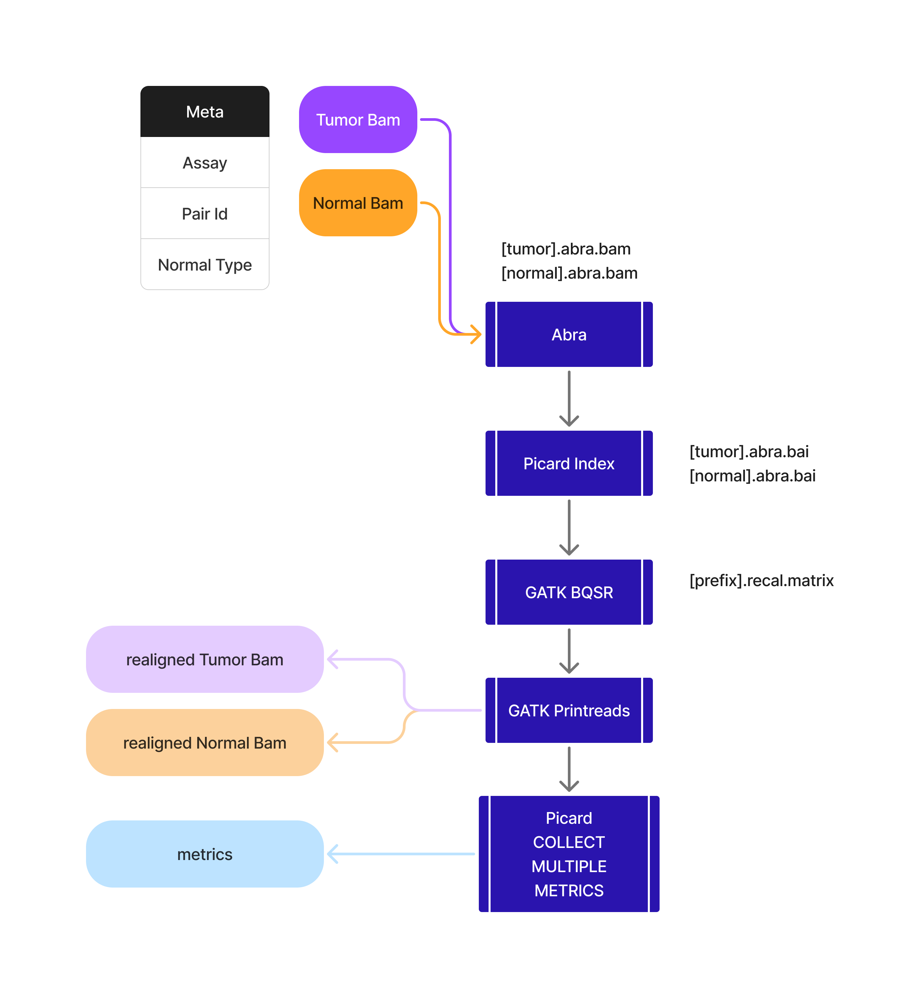

<!--[](https://github.com/mskcc/arrakis/actions/workflows/ci.yml)
[](https://github.com/mskcc/arrakis/actions/workflows/linting.yml)[](https://doi.org/10.5281/zenodo.XXXXXXX)-->

[](https://www.nf-test.com)

[](https://www.nextflow.io/)
[](https://docs.conda.io/en/latest/)
[](https://www.docker.com/)
[](https://sylabs.io/docs/)
[](https://tower.nf/launch?pipeline=https://github.com/mskcc/arrakis)

## Introduction

**mskcc/arrakis** is a bioinformatics pipeline that performs reallignment and Base Quality Score Recalibration on bams.



1. Reallignment ([`ABRA`](https://github.com/mozack/abra2))
2. Base Quality Score Recalibration ([`GATK_BQSR`](https://gatk.broadinstitute.org/hc/en-us/articles/360035890531-Base-Quality-Score-Recalibration-BQSR))
3. PrintReads ([`GATK_PrintReads`](https://gatk.broadinstitute.org/hc/en-us/articles/360036883571-PrintReads))
4. Generate Metrics ([`PICARD_CollectMultipleMetrics`](https://gatk.broadinstitute.org/hc/en-us/articles/360037594031-CollectMultipleMetrics-Picard))

## Usage

> [!NOTE]
> If you are new to Nextflow and nf-core, please refer to [this page](https://nf-co.re/docs/usage/installation) on how to set-up Nextflow. Make sure to [test your setup](https://nf-co.re/docs/usage/introduction#how-to-run-a-pipeline) with `-profile test` before running the workflow on actual data.

First, prepare a samplesheet with your input data that looks as follows:

`samplesheet.csv`:

```csv
pairId,tumorBam,normalBam,assay,normalType,bedFile
foo_sample,foo_tumor.rg.md.bam,foo_normal.rg.md.bam,IMPACT505,MATCHED,foo_tumor.foo_normal.fci.bed
bar_sample,bar_tumor.rg.md.bam,bar_normal.rg.md.bam,IMPACT505,MATCHED,bar_tumor.bar_normal.fci.bed
```

Now, you can run the pipeline using:

<!-- TODO nf-core: update the following command to include all required parameters for a minimal example -->

```bash
nextflow run mskcc/arrakis \
   -profile singularity,test_juno \
   --input samplesheet.csv \
   --outdir <OUTDIR>
```

> [!NOTE]
> You must include `test_juno` as your profile for the workflow to run properly

The `test_juno` parameter file does not need to be modified if you are using `grch_37` and do no want to modify the `known_sites` used by BQSR.

## Modifying the config

- If you would like to add more known sites you can modify the config file [here](https://github.com/mskcc/Arrakis/blob/master/conf/test_juno.config#L59)
- If you would like to use a diffrent genome you need to first add your genome files [here](https://github.com/mskcc/Arrakis/blob/master/conf/juno_resources.config#L2) and then add your genome key [here](https://github.com/mskcc/Arrakis/blob/master/conf/test_juno.config#L38)

> [!WARNING]
> Please provide pipeline parameters via the CLI or Nextflow `-params-file` option. Custom config files including those provided by the `-c` Nextflow option can be used to provide any configuration _**except for parameters**_;
> see [docs](https://nf-co.re/usage/configuration#custom-configuration-files).

## Output structure

The output of the pipeline will be organized by the pairId provided. For the example above the output will look like:

```
├── bar_sample
│   ├── bar_normal.rg.md.abra.bai
│   ├── bar_normal.rg.md.abra.bam
│   ├── bar_normal.rg.md.abra.bam.bai
│   ├── bar_normal.rg.md.abra.printreads.bai
│   ├── bar_normal.rg.md.abra.printreads.bam
│   ├── bar_normal.rg.md.abra.printreads.qmetrics.quality_by_cycle.pdf
│   ├── bar_normal.rg.md.abra.printreads.qmetrics.quality_by_cycle_metrics
│   ├── bar_sample.recal.matrix
│   ├── bar_tumor.rg.md.abra.bai
│   ├── bar_tumor.rg.md.abra.bam
│   ├── bar_tumor.rg.md.abra.bam.bai
│   ├── bar_tumor.rg.md.abra.printreads.bai
│   ├── bar_tumor.rg.md.abra.printreads.bam
│   ├── bar_tumor.rg.md.abra.printreads.qmetrics.quality_by_cycle.pdf
│   ├── bar_tumor.rg.md.abra.printreads.qmetrics.quality_by_cycle_metrics
│   └── versions.yml
├── foo_sample
│   ├── foo_normal.rg.md.abra.bai
│   ├── foo_normal.rg.md.abra.bam
│   ├── foo_normal.rg.md.abra.bam.bai
│   ├── foo_normal.rg.md.abra.printreads.bai
│   ├── foo_normal.rg.md.abra.printreads.bam
│   ├── foo_normal.rg.md.abra.printreads.qmetrics.quality_by_cycle.pdf
│   ├── foo_normal.rg.md.abra.printreads.qmetrics.quality_by_cycle_metrics
│   ├── foo_sample.recal.matrix
│   ├── foo_tumor.rg.md.abra.bai
│   ├── foo_tumor.rg.md.abra.bam
│   ├── foo_tumor.rg.md.abra.bam.bai
│   ├── foo_tumor.rg.md.abra.printreads.bai
│   ├── foo_tumor.rg.md.abra.printreads.bam
│   ├── foo_tumor.rg.md.abra.printreads.qmetrics.quality_by_cycle.pdf
│   ├── foo_tumor.rg.md.abra.printreads.qmetrics.quality_by_cycle_metrics
│   └── versions.yml
└── pipeline_info
    ├── execution_report_2024-03-08_12-44-35.html
    ├── execution_timeline_2024-03-08_12-44-35.html
    ├── execution_trace_2024-03-08_12-44-35.txt
    ├── nf_core_pipeline_software_mqc_versions.yml
    ├── params_2024-03-08_12-44-37.json
    └── pipeline_dag_2024-03-08_12-44-35.html
```

## Credits

mskcc/arrakis was originally written by Nikhil Kumar ([@nikhil](https://github.com/nikhil)).

We thank the following people for their extensive assistance in the development of this pipeline:

## Contributions and Support

If you would like to contribute to this pipeline, please see the [contributing guidelines](.github/CONTRIBUTING.md).

## Citations

- Lisle E Mose, Charles M Perou, Joel S Parker, Improved indel detection in DNA and RNA via realignment with ABRA2, Bioinformatics, Volume 35, Issue 17, September 2019, Pages 2966–2973, https://doi.org/10.1093/bioinformatics/btz033
- “Picard Toolkit.” 2019. Broad Institute, GitHub Repository. https://broadinstitute.github.io/picard/; Broad Institute
- Van der Auwera, G. A., Carneiro, M. O., Hartl, C., Poplin, R., Del Angel, G., Levy-Moonshine, A., Jordan, T., Shakir, K., Roazen, D., Thibault, J., Banks, E., Garimella, K. V., Altshuler, D., Gabriel, S., & DePristo, M. A. (2013). From FastQ data to high confidence variant calls: the Genome Analysis Toolkit best practices pipeline. Current protocols in bioinformatics, 43(1110), 11.10.1–11.10.33. https://doi.org/10.1002/0471250953.bi1110s43

An extensive list of references for the tools used by the pipeline can be found in the [`CITATIONS.md`](CITATIONS.md) file.

This pipeline uses code and infrastructure developed and maintained by the [nf-core](https://nf-co.re) community, reused here under the [MIT license](https://github.com/nf-core/tools/blob/master/LICENSE).

> **The nf-core framework for community-curated bioinformatics pipelines.**
>
> Philip Ewels, Alexander Peltzer, Sven Fillinger, Harshil Patel, Johannes Alneberg, Andreas Wilm, Maxime Ulysse Garcia, Paolo Di Tommaso & Sven Nahnsen.
>
> _Nat Biotechnol._ 2020 Feb 13. doi: [10.1038/s41587-020-0439-x](https://dx.doi.org/10.1038/s41587-020-0439-x).
